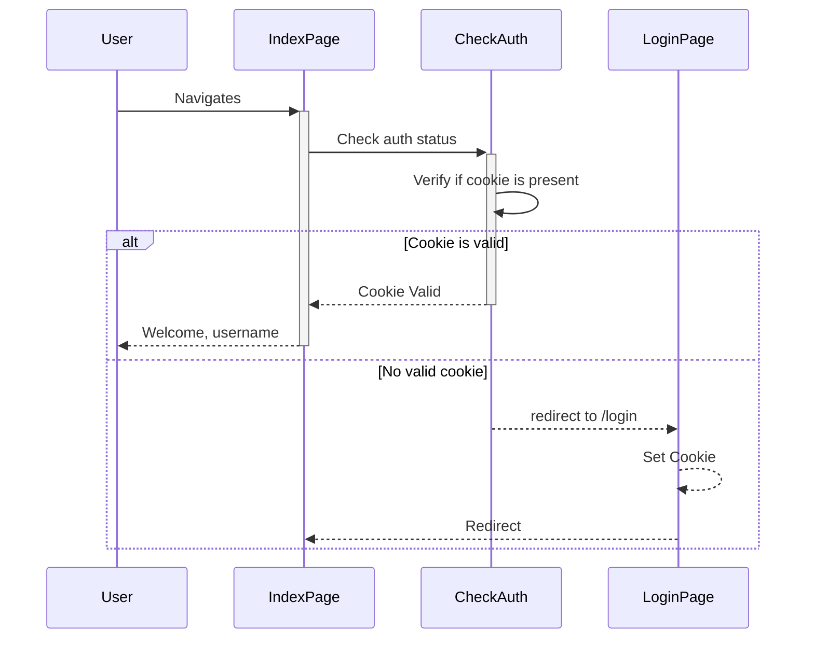

# go-telegram-auth

```mermaid
sequenceDiagram
    User ->>+IndexPage: Navigates
    IndexPage ->>+CheckAuth: Check auth status
    CheckAuth ->>CheckAuth: Verify if cookie is present
    Alt Cookie is valid
    CheckAuth -->>-IndexPage: Cookie Valid
    IndexPage -->>-User: Welcome, username
    else No valid cookie
    CheckAuth -->>LoginPage: redirect to /login
    LoginPage -->>LoginPage: Set Cookie
    LoginPage -->>IndexPage: Redirect
    end
```