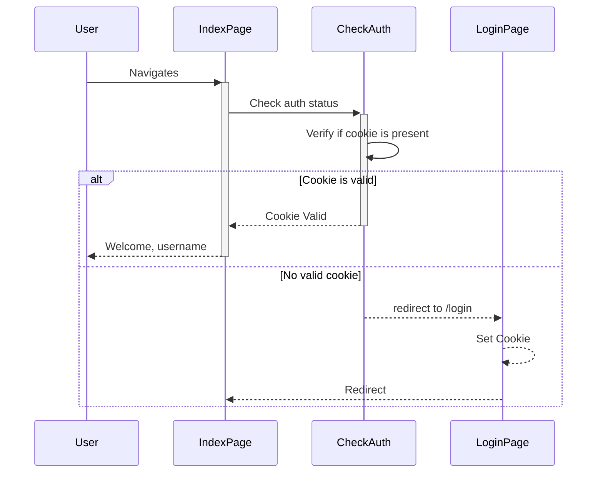

# go-telegram-auth: web authentication with Telegram

This library allows for simple web page authentication with Telegram. 

Documentation is WIP, but please check [this example](https://github.com/sgzmd/tgauth) which 
was the starting point for this library.

Given this library relies on Telegram's API and requires some steps to be taken prior to use,
integrating with it requires few extra actions.  Here we explain how to use this library, 
by utilising the sample provided in `samples/basic/basic-sample.go`.

## Preparation

Before you start, I strongly encourage you to read [Telegram Login Widget](https://core.telegram.org/widgets/login)
documentation, however limited it is. I strongly encourage you to understand it before proceeding.

Follow the steps at the Telegram page above to create your own Telegram bot which will be used for
authentication. Make sure to store bot token - you'll need it later!

Note, that when using `/setdomain` with Telegram bot it will refuse localhost domains - making testing
significantly harder. Furthermore, it clearly doesn't like custom ports (i.e. not 80/443). Here's how I
worked around both limitations:

1. Set custom host in your system to point to `127.0.0.1`. On Linux/Mac it will be file named `/etc/hosts`;
   on Windows it's `c:\windows\system32\drivers\etc\hosts`. Add an entry like: `127.0.0.1 tgauth.com` - I used domain
   `tgauth.com` throughout this example, but you can choose something else.
2. Tricky bit - use `mitmproxy` to forward requests from a privileged port 80 to non-privileged port your test app
   will be running (`8080` in this example). If you are using WSL as I did in this case, you will need to follow
   the previous step _also_ in your WSL container as if you are on Linux (i.e. `/etc/hosts`). Then run:

    ```shell
    sudo mitmproxy --listen-host tgauth.com \
      --listen-port 80 --mode reverse:http://localhost:8080/
    ```
   You will need to use `sudo` to use privileged port `80`.

If you've set up everything correctly, now all requests to [http://tgauth.com](http://tgauth.com) will be forwarded
to `localhost:8080`.

> **Note**
> For simplicity sake you can skip this step altogether and run the sample using port 80,
> but this will require running it as root using `sudo` - which for obvious security reasons
> we can neither recommend nor endorse.

You can generate your own widget code, but there is one already in `basic-sample.go`, which is configurable
to use your own bot name and URLs.

## Preparing the sample
Sample code can be largely run as is, with only two modifications:

```go
package main

// ...

const (
   // BotName -- You will **most definitely need** to change this to your own bot name 
   BotName = "sgzmd_tgauth_bot"

   // Domain -- If you have chosen a different domain in the step above, make sure to update it here
   Domain = "tgauth.com"
)
```

You can now run the code as follows:

```shell
go build -o sample samples/basic/basic-sample.go
./sample -telegram_api_key=<your-telegram-api-key>
```

Substitute `<your-telegram-api-key>` to the one provided by @BotFather and you are good to go.

## How does it work

