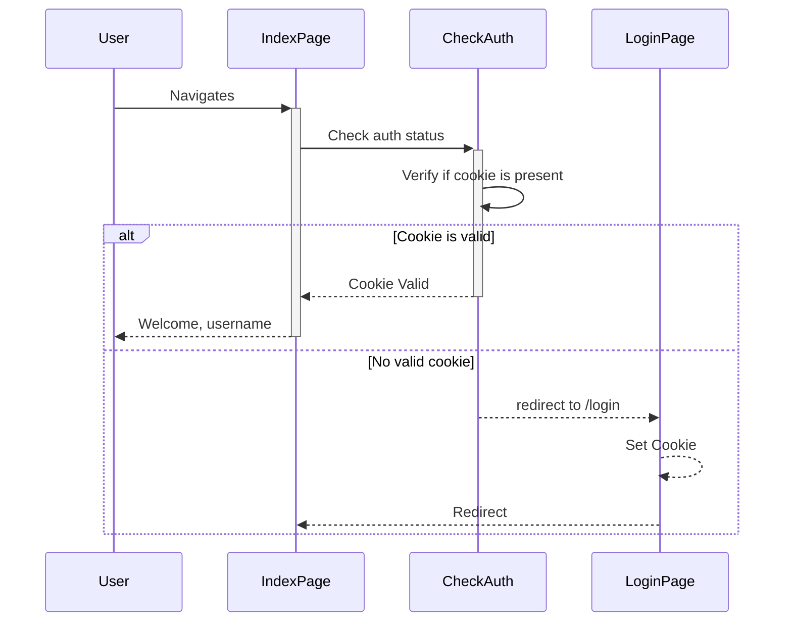

# go-telegram-auth: web authentication with Telegram

This library allows for simple web page authentication with Telegram. 

Documentation is not ready yet, but please check [this example](https://github.com/sgzmd/tgauth) which 
was the starting point for this library.

